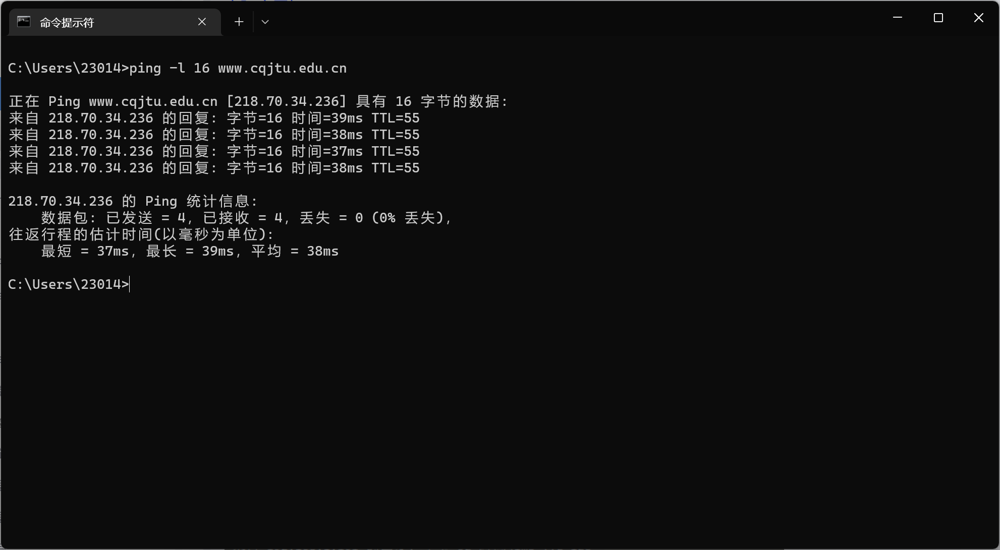
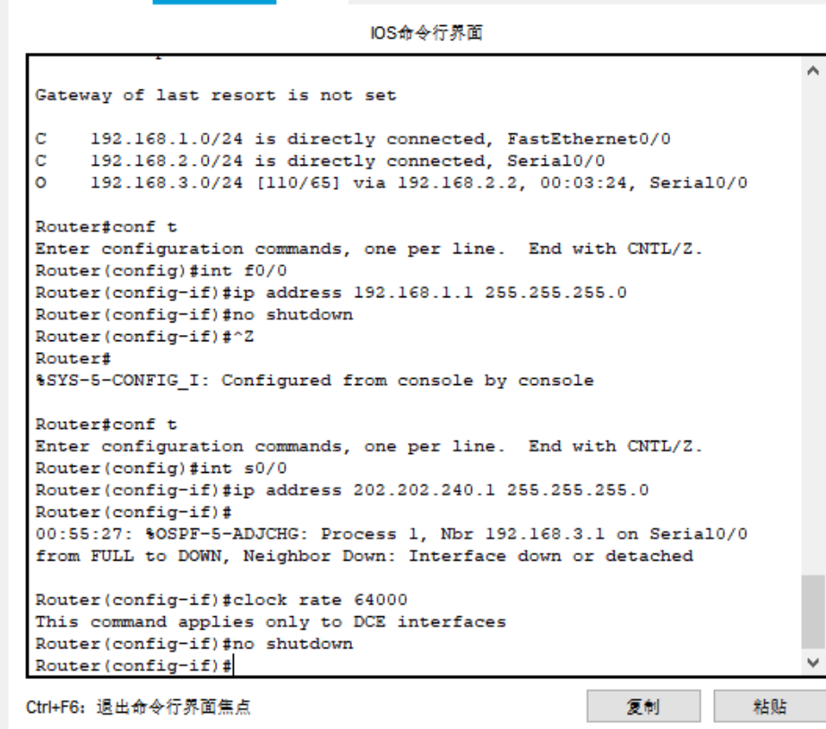

[TOC]

# 计算机网络实验

## 验证性实验

### ipconfig

Ipconfig是调试计算机网络的常用命令，通常大家使用它显示计算机中网络适配器的IP地址、子网掩码及默认网关

**1. 使用 ipconfig/all 查看自己计算机的网络配置，尽可能明白每行的意思，特别注意 IP 地址、子网掩码 Subnet Mask、网关 Gateway。**


* **IP地址** 192.168.31.132
* **子网掩码** 255.255.255.0
* **网关** 192.168.31.1

---

>  **问题：你的计算机和旁边的计算机是否处于同一子网，为什么？**
> 
> **答**：是处于同一子网,因为IP地址的网络号相同，主机号不同，并且其子网掩码和网关相同。IP地址与子网掩码按位相与后得到相同的网络地址。


### ping

ping （Packet Internet Groper）是一种因特网包探索器，用于测试网络连接量的程序。ping是工作在 TCP/IP网络体系结构中应用层的一个服务命令， 主要是向特定的目的主机发送 ICMP（Internet Control Message Protocol 因特网报文控制协议）Echo 请求报文，测试目的站是否可达及了解其有关状态。

**1. 要测试到某计算机如 重庆交通大学 Web 服务器的连通性，可以使用 ping www.cqjtu.edu.cn 命令，也可直接使用IP 地址。**


**参数说明：**
* **字节** 32
  表明每次发32字节的包
* **时间** 6ms
  与该IP地址往返一次用时为6ms
* **TTL** 59
  TTL：Time to Live 意为存活时间为59

**2. 使用 ping/? 命令了解该命令的各种选项并实际使用。**


**应用：**
* **ping -t 发送数据直到中断**
  CTRL-C 发送中断命令。
  
* **ping -a 反向名称解析**
  
* **ping -l 指定字节数**
  

---


>  **问题1. 假设你不能 ping 通某计算机或 IP，但你确定该计算机和你之间的网络是连通的，那么可能的原因是什么？该如何处理能保证 ping 通？**
> 
> **答**：
> **可能原因是：** 两者不属于一个子网。或设立了防火墙，防火墙阻止了这次链接。
> **通过由近及远的连通性测试来解决具体步骤为**
> 1. ping本机(127.0.0.1)确保主机网络软硬件工作正常。
> 2. ping另一个台主机，来测试子网内部是否工作正常。如果出现错误，则检查本机网卡与交换机的连线。
> 3. ping网关，测试网关连通性。如果出现问题，则需求助网管。
> 4. ping任意一个IP地址，如百度、搜狗等。如果失败，则问题出现在网关之外，无法自己解决。
>
> **问题2. 假设ping 14.215.177.39没有问题，但ping百度的域名 www.baidu.com不行，那么可能的原因是什么？如何进行验证和解决？？**
> 
> **答**：DNS是设置错误，一般是更改DNS的软件在更改后没有恢复。DNS设置错误，会导致域名解析失败。可以通过清空DNS缓存或联系网络运营商解决。

### tracert

Tracert（跟踪路由）是路由跟踪实用程序，用于确定 IP数据包访问目标所采取的路径。Tracert 命令使用用 IP 生存时间 (TTL) 字段和 ICMP 错误消息来确定从一个主机到网络上其他主机的路由。

**1. 要了解到某计算机如 www.baidu.com 中间经过了哪些节点（路由器）及其它状态，可使用 tracert www.baidu.com 命令，查看反馈的信息，了解节点的个数。**


**2. ping.pe 这个网站可以探测从全球主要的 ISP 到某站点如 https://qige.io的线路状态，当然也包括各线路到该主机的路由情况。请使用浏览器访问 http://ping.pe/qige.io 进行了解。**


---

>  **问题一：tracert能告诉我们路径上的节点以及大致的延迟等信息，那么它背后的原理是什么？**
通过向目标地址发送不同IP存活时间值的“Internet控制消息协议（ICMP）”回应数据包，tracer诊断程序确定到目标地址所经过的路由。 要求路径上的每个路由器在转发数据包之前至少将数据包上的TTL递减1.数据包上的TTL减为0时，路由器应该将“ICMP已超时”的消息发回源系统。tracert先发送TTL为1的回应数据包，并在随后的每次发送过程将TTL递减1，直到目标响应或TTL达到最大值，从而确定路由。通过检查中间路由器发回的“ICMP已超时”的消息确定路由。某些路由器不经询问直接丢弃TTL过期的数据包，这在tracert使用程序中看不到。
**问题二：在以上两个实作中，无论是访问百度还是棋歌教学网，路径中的第一条都是相同的，甚至似乎前几个节点都是相同的，你的解释是什么？**
无论目的地址是什么，数据只要是从本机发送出去，都要到达同一个交换机，所以路径中的第一条都是相同的。前几个节点都相同可能是因为数据要出去需要经过网关，进而才能通过不同的子网到达不同的目的地址，而从本机过网关的路径都大致相同，所以前几个节点都是相同的。
**问题三：在追踪过程中，你可能会看到路径中某些节点显示为 * 号，这是发生了什么？**
该节点等待超时。

### ARP

地址解析协议，即ARP（Address Resolution Protocol），是根据IP地址获取物理地址的一个TCP/IP协议。主机发送信息时将包含目标IP地址的ARP请求广播到局域网络上的所有主机，并接收返回消息，以此确定目标的物理地址；收到返回消息后将该IP地址和物理地址存入本机ARP缓存中并保留一定时间，下次请求时直接查询ARP缓存以节约资源。地址解析协议是建立在网络中各个主机互相信任的基础上的，局域网络上的主机可以自主发送ARP应答消息，其他主机收到应答报文时不会检测该报文的真实性就会将其记入本机ARP缓存；由此攻击者就可以向某一主机发送伪ARP应答报文，使其发送的信息无法到达预期的主机或到达错误的主机，这就构成了一个ARP欺骗。ARP命令可用于查询本机ARP缓存中IP地址和MAC地址的对应关系、添加或删除静态对应关系等。相关协议有RARP、代理ARP。NDP用于在IPv6中代替地址解析协议。

**1. 运行 arp -a 命令查看当前的 arp 缓存， 请留意缓存了些什么。**


**2. 请使用 arp /? 命令了解该命令的各种选项**


---

> **问题：在实作三中，为何缓存中常常有网关的信息？我们将网关或其他计算机的arp信息设置为静态有什么优缺点？**
缓存中常有网关信息是因为缓存本身记录了用户访问过的pc网卡mac物理地址。
优点有：便于以固定的IP地址或IP地址分组产生的流量为依据管理，可以避免用户忘记密码而进行的繁琐事务流程；
缺点有：合法用户分配的地址可能被非法盗用，不仅对网络的正常使用造成影响，同时由于被盗用的地址往往具有较高的权限，因而也容易给合法用户造成损失和潜在的安全隐患。


### DHCP

动态主机配置协议 DHCP（Dynamic Host Configuration Protocol，动态主机配置协议） 是 RFC 1541（已被 RFC 2131 取代）定义的标准协议，该协议允许服务器向客户端动态分配 IP 地址和配置信息。

**1. 一般地，我们自动获取的网络配置信息包括：IP 地址、子网掩码、网关 IP 以及 DNS 服务器 IP 等。使用ipconfig/release 命令释放自动获取的网络配置，并用 ipconfig/renew 命令重新获取，了解 DHCP 工作过程和原理**


---

> **问题：在Windows系统下，如果由于某种原因计算机不能获取 DHCP 服务器的配置数据，那么Windows将会根据某种算法自动配置为 169.254.x.x 这样的 IP 地址。显然，这样的 IP 以及相关的配置信息是不能让我们真正接入 Internet 的，为什么？既然不能接入 Internet，那么Winodws系统采用这样的方案有什么意义？**
因为自动配置的IP地址和信息只是短暂性的解决计算机不能获取 DHCP 服务器的配置数据的问题，要真正的接入Internet还是得本身计算机的正确IP地址。意义是当因DHCP服务器问题不能获得网络配置时，我们可以查看隔壁教室计算机的配置信息来手动进行网络配置，从而使该计算机能够接入Internet。


### netstat

Netstat是控制台命令,是一个监控TCP/IP网络的非常有用的工具，它可以显示路由表、实际的网络连接以及每一个网络接口设备的状态信息。Netstat用于显示与IP、TCP、UDP和ICMP协议相关的统计数据，一般用于检验本机各端口的网络连接情况。

**1. Windows 系统将一些常用的端口与服务记录在 C:\WINDOWS\system32\drivers\etc\services文件中，请查看该文件了解常用的端口号分配。**


**2. 使用 netstat -an 命令，查看计算机当前的网络连接状况。更多的 netstat 命令选项，可参考上面链接 4 和 5 。**


### DNS

DNS（Domain Name System）即域名系统，是互联网的一项服务。它作为将域名和 IP 地址相互映射的一个分布式数据库，能够使人更方便地访问互联网。DNS 使用 TCP 和 UDP 的 53 号端口。

**1. Windows 系统将一些固定的/静态的 DNS信息记录C:\WINDOWS\system32\drivers\etc\hosts 文件中，如我们常用的 localhost 就对应127.0.0.1 。请查看该文件看看有什么记录在该文件中。**


**2. 解析过的 DNS 记录将会被缓存，以利于加快解析速度。请使用 ipconfig /displaydns 命令查看。我们也可以使用ipconfig /flushdns 命令来清除所有的 DNS 缓存。**


**3. 使用 nslookup qige.io 命令，将使用默认的 DNS 服务器查询该域名。当然你也可以指定使用CloudFlare（1.1.1.1）或 Google（8.8.8.8） 的全球 DNS 服务器来解析，如：nslookup qige.io 8.8.8.8，当然，由于你懂的原因，这不一定会得到正确的答案。**


---
> **问题：使用插件或自己修改hosts文件来屏蔽广告，思考一下这种方式为何能过滤广告？如果某些广告拦截失效，那么是什么原因？你应该怎么进行分析从而能够成功屏蔽它？**
hosts文件是一个用于存储计算机网络中节点信息的文件，它可以将主机名映射到相应的IP地址，实现DNS的功能，它可以由计算机的用户进行控制。
hosts相当于一个字典，如果查到输入的域名在hosts之中，则会先调用其对应的IP，而不通过DNS，因此能够通过手动添加修改错误的<ip-网址>来达到屏蔽某网站的目的。通过将127.0.0.1广告链接设置为广告推送链接，从而广告链接就不会访问到本机，而是访问它自己的服务器。
如果广告拦截失效，是因为有跨服务器访问问题，可以使用adsafe广告管家解决这个问题。


### cache

cache 即缓存，是 IT 领域一个重要的技术。我们此处提到的 cache 主要是浏览器缓存。
浏览器缓存是根据 HTTP 报文的缓存标识进行的，是性能优化中简单高效的一种优化方式了。一个优秀的缓存策略可以缩短网页请求资源的距离，减少延迟，并且由于缓存文件可以重复利用，还可以减少带宽，降低网络负荷。

**1. 打开 Chrome 或 Firefox 浏览器，访问 https://qige.io ，接下来敲 F12 键 或 Ctrl +Shift + I 组合键打开开发者工具，选择 Network 面板后刷新页面，你会在开发者工具底部看到加载该页面花费的时间。请进一步查看哪些文件被 cache了，哪些没有。经过对比可以发现一些图片，js文件和txt文件被缓存了，而一些CSS文件没有**


**2. 接下来仍在 Network 面板，选择 Disable cache 选项框，表明当前不使用 cache，页面数据全部来自于Internet，刷新页面，再次在开发者工具底部查看加载该页面花费的时间。你可比对与cache 时的加载速度差异。**


## WireShark实验

### 数学链路层
开始界面：
**1. 熟悉 Ethernet 帧结构 使用 Wireshark 任意进行抓包，熟悉 Ethernet 帧的结构，如：目的 MAC、源 MAC、类型、字段等。**


---

>  **问题：你会发现 Wireshark 展现给我们的帧中没有校验字段，请了解一下原因。**
> Wireshark 抓包前，在物理层网卡已经去掉了一些之前几层加的东西，比如前导同步码，FCS等等，之后利用校验码CRC校验，正确时才会进行下一步操作，因此，抓包软件抓到的是去掉前导同步码、FCS之外的数据，没有校验字段.。


**2. 了解子网内/外通信时的 MAC 地址**

---

>  **问题：通过以上的实验，你会发现：1、访问本子网的计算机时，目的 MAC 就是该主机的 2、访问非本子网的计算机时，目的 MAC 是网关的。请问原因是什么？**
> 因为访问本子网的计算机时，是两台主机在进行通信，所以MAC是目标主机的。而当要访问非本子网的计算机时，首先数据首先要到达本子网的网关，再有网关进行传输，所以目的MAC是网关的。

**3. 掌握 ARP 解析过程**

---

>  **问题：通过以上的实验，你应该会发现 1、ARP 请求都是使用广播方式发送的 2、如果访问的是本子网的 IP，那么 ARP 解析将直接得到该 IP 对应的 MAC；如果访问的非本子网的 IP， 那么 ARP 解析将得到网关的 MAC。请问为什么？**
因为当没有配置缺省网关的计算机要和其他网络中的计算机实现通信时，网关收到源计算机的ARP请求会使用自己的MAC地址与目标计算机的IP地址对源计算机进行应答，访问非子网IP时是通过路由器访问的，路由器再把发出去，目标IP收到请求后，再通过路由器端口IP返回去，那么ARP解析将会得到网关的MAC。


### 网络层

**1. 熟悉 IP 包结构 使用 Wireshark 任意进行抓包（可用 ip 过滤），熟悉 IP包的结构，如：版本、头部长度、总长度、TTL、协议类型等字段。**


---

>  **问题：为提高效率，我们应该让 IP 的头部尽可能的精简。但在如此珍贵的 IP 头部你会发现既有头部长度字段，也有总长度字段。请问为什么？**
这样能帮助传输时的识别IP总长度，提高传输效率

**2. IP 包的分段与重组 根据规定，一个 IP 包最大可以有 64K 字节。但由于 Ethernet 帧的限制，当 IP 包的数据超过1500 字节时就会被发送方的数据链路层分段，然后在接收方的网络层重组。 缺省的，ping 命令只会向对方发送 32个字节的数据。我们可以使用 ping 202.202.240.16 -l 2000 命令指定要发送的数据长度。此时使用 Wireshark抓包（用 ip.addr == 202.202.240.16 进行过滤），了解 IP 包如何进行分段，如：分段标志、偏移量以及每个包的大小等**


---

>  **问题：分段与重组是一个耗费资源的操作，特别是当分段由传送路径上的节点即路由器来完成的时候，所以 IPv6 已经不允许分段了。那么 IPv6 中，如果路由器遇到了一个大数据包该怎么办？**
转发到支持该数据传输的路由上或者丢弃该数据包。


**3. 考察 TTL 事件 在 IP 包头中有一个 TTL 字段用来限定该包可以在 Internet上传输多少跳（hops），一般该值设置为64、128等。 在验证性实验部分我们使用了 tracert 命令进行路由追踪。其原理是主动设置 IP 包的 TTL 值，从 1开始逐渐增加，直至到达最终目的主机。 请使用 tracert www.baidu.com 命令进行追踪，此时使用 Wireshark 抓包（用 icmp 过滤），分析每个发送包的 TTL 是如何进行改变的，从而理解路由追踪原理。**


> **由此可见，TTL从1开始，每过一个路由便增加1**

---

>  **问题：在 IPv4 中，TTL 虽然定义为生命期即 Time To Live，但现实中我们都以跳数/节点数进行设置。如果你收到一个包，其 TTL 的值为 50，那么可以推断这个包从源点到你之间有多少跳？**
TTL一般是2的整数次幂，如果TTL为50，那就找到距离50最近的2的整数次幂就是64，然后经过64-50+1=15个
15跳

### 传输层

**1. 熟悉 TCP 和 UDP 段结构**
* UDP

* TCP


---

>  **问题：由上大家可以看到 UDP 的头部比 TCP 简单得多，但两者都有源和目的端口号。请问源和目的端口号用来干什么？**
端口代表着接收与收发端不同的应用程序，源端口与目的端口相连，实现两个程序之间的通信。

**2. 分析 TCP 建立和释放连接**

* 请在你捕获的包中找到三次握手建立连接的包，并说明为何它们是用于建立连接的，有什么特征
  * 第一次握手，SYN1，ACK0
    
  * 第二次握手，SYN1，ACK1
    
  * 第三次握手，SYN0，ACK1
    

* 请在你捕获的包中找到四次挥手释放连接的包，并说明为何它们是用于释放连接的，有什么特征。
  * 第一次握手ACk1，FIN1
    
  * 第二次握手ACK1，FIN0
    
  * 第三次握手ACK1，FIN1
    
  * 第四次握手ACK1，FIN0
    

  

---

>  **问题一：去掉 Follow TCP Stream，即不跟踪一个 TCP 流，你可能会看到访问 qige.io 时我们建立的连接有多个。请思考为什么会有多个连接？作用是什么？**
这属于短连接，这为了实现多个用户进行访问，对业务频率不高的场合，不让其长期占用通道。一个网页由多个部分组成，在头部的link标签中可能也有很多链接来寻找一些css或者js文件等其他文件。并行查找，加快网页展示速度。

>  **问题二：我们上面提到了释放连接需要四次挥手，有时你可能会抓到只有三次挥手。原因是什么？**
服务器向客户端发送断开连接和回复同意断开连接合成一次挥手。


### 应用层

**1. 了解 DNS 解析**


---

>  **问题：你可能会发现对同一个站点，我们发出的 DNS 解析请求不止一个，思考一下是什么原因？**
> DNS不止一个的原因可能是DNS解析过程是先从浏览器的DNS缓存中检查是否有这个网址的映射关系，如果有，就返回IP，完成域名解析；如果没有，操作系统会先检查自己本地的hosts文件是否有这个网址的映射关系，如果有，就返回IP，完成域名解析；如果还没有，电脑就要向本地DNS服务器发起请求查询域名；本地DNS服务器拿到请求后，先检查一下自己的缓存中有没有这个地址，有的话直接返回；没有的话本地DNS服务器会从配置文件中读取根DNS服务器的地址，然后向其中一台发起请求；直到获得对应的IP为止。


**2. 了解 HTTP 的请求和应答**


---

>  **问题：刷新一次 qige.io 网站的页面同时进行抓包，你会发现不少的 304 代码的应答，这是所请求的对象没有更改的意思，让浏览器使用本地缓存的内容即可。那么服务器为什么会回答 304 应答而不是常见的 200 应答？**
> 浏览器中的缓存，可以直接在缓存区获取到需要的内容，不需要服务器在回复对应的内容，可以减少服务器的一些工作，减小开销。
> 采用200应答就是要完全的将内容发送给客服端，这个会增加服务器的一些开销等。


## Cisco Packet Tracer

### 直接连接两台 PC 构建 LAN

  
  
  
  

### 用交换机构建 LAN

  
  
  

### 交换机接口地址列表
  
  
  

### 生成树协议（Spanning Tree Protocol）

  
  

### 路由器配置初步
  模拟重庆交通大学和重庆大学两个学校的连接

  

  配置如下：
  
  

  重庆交通大学路由器基本配置如下：
  以太网口：
    
  ```
  Router>enable   
  Router#configure terminal   
  Router(config)#interface f0/0   
  Router(config-if)#ip address 192.168.1.1 255.255.255.0
  Router(config-if)#no shutdown   
  Router(config-if)#^z   
  Router#
  ```

  广域网口：
  ```
  Router>en   
  Router#conf t   
  Router(config)#int s0/0   
  Router(config-if)#ip address 192.168.2.1 255.255.255.0 
  Router(config-if)#clock rate 64000    
  Router(config-if)#no shutdown  
  Router(config-if)#^z  
  Router#
  ```

  重庆大学路由器基本配置如下：

  以太网口：
  ```
  Router>en   
  Router#conf t   
  Router(config)#int f0/0   
  Router(config-if)#ip address 192.168.3.1 255.255.255.0 
  Router(config-if)#no shutdown  
  Router(config-if)#^z   
  Router#
  ```

  广域网口：

  ```
  Router>en   
  Router#conf t   
  Router(config)#int s0/0  
  Router(config-if)#ip address 192.168.2.2 255.255.255.0   
  Router(config-if)#no shutdown   
  Router(config-if)#^z   
  Router#
  ```

  PC:
  |节点名|IP|子网掩码|网关|
  |------|---|---|---|
  |交通大学 PC0|192.168.1.2|255.255.255.0|192.168.1.1|
  |交通大学 PC1|192.168.1.3|255.255.255.0|192.168.1.1|
  |重庆大学 PC2|192.168.3.2|255.255.255.0|192.168.3.1|
  |重庆大学 PC3|192.168.3.3|255.255.255.0|192.168.3.1|

  配置完成后
  

  ---
  > **问题：现在交通大学内的各 PC 及网关相互能 ping 通，重庆大学也类似。但不能从交大的 PC ping 通重大的 PC，反之亦然，也即不能跨子网。为什么？**
  没有配置静态路由，路由表尚未构建。


### 静态路由

静态路由是非自适应性路由协议，是由网络管理人员手动配置的，不能够根据网络拓扑的变化而改变。 因此，静态路由简单高效，适用于结构非常简单的网络。

  **重庆交通大学静态路由配置：**
  

  **重庆大学静态路由配置：**
  

### 动态路由 RIP

动态路由协议采用自适应路由算法，能够根据网络拓扑的变化而重新计算机最佳路由。

RIP 的全称是 Routing Information Protocol，是距离矢量路由的代表（目前虽然淘汰，但可作为我们学习的对象）。使用 RIP 协议只需要告诉路由器直接相连有哪些网络即可，然后 RIP 根据算法自动构建出路由表。

因为我们模拟的网络非常简单，因此不能同时使用静态和动态路由，否则看不出效果，所以我们需要把刚才配置的静态路由先清除掉。

  
  

  **重庆交通大学RIP路由配置：**
  

  **重庆大学RIP路由配置：**
  

### 动态路由 OSPF

OSPF（Open Shortest Path First 开放式最短路径优先）是一个内部网关协议（Interior Gateway Protocol，简称 IGP）， 用于在单一自治系统（Autonomous System，AS）内决策路由。OSPF 性能优于 RIP，是当前域内路由广泛使用的路由协议。

同样的，我们需要把刚才配置的 RIP 路由先清除掉。

  
  

  **重庆交通大学OSPF路由配置：**
  

  **重庆大学OSPF路由配置：**
  

### 基于端口的网络地址翻译 PAT

  网络地址转换（NAT，Network Address Translation）被各个 Internet 服务商即 ISP 广泛应用于它们的网络中，也包括 WiFi 网络。 原因很简单，NAT 不仅完美地解决了 lP 地址不足的问题，而且还能够有效地避免来自网络外部的攻击，隐藏并保护网络内部的计算机。

  **NAT 的实现方式一般有三种：**

  * 静态转换： Static NAT

  * 动态转换： Dynamic NAT

  * 端口多路复用： OverLoad

  端口多路复用使用最多也最灵活。OverLoad 是指不仅改变发向 Internet 数据包的源 IP 地址，同时还改变其源端口，即进行了端口地址转换（PAT，Port Address Translation）。

  采用端口多路复用方式，内部网络的所有主机均可共享一个合法外部 IP 地址实现对 Internet 的访问，从而可以最大限度地节约IP地址资源。 同时，又可隐藏网络内部的所有主机，有效避免来自 Internet 的攻击。因此，目前网络中应用最多的就是端口多路复用方式。

  我们仍然使用重庆交通大学和重庆大学两个学校的拓扑进行 PAT 实验。我们需要保证两个学校的路由已经配置成功，无论使用静态路由还是动态路由，以下我们给出完整的配置过程：设定这两个学校的路由器使用 OSPF 协议，模拟交通大学使用内部 IP 地址（192.168.1.0/24），模拟重庆大学使用外部 IP 地址（8.8.8.0/24），两个路由器之间使用外部 IP 地址（202.202.240.0/24），在交通大学的出口位置即广域网口实施 PAT。

  **拓扑图中各 PC 配置数据如下：**

  |节点名|IP|子网掩码|网关|
  |------|---|----|------|
  |交通大学 PC0|192.168.1.2|255.255.255.0|192.168.1.1|
  |交通大学 PC1|192.168.1.3|255.255.255.0|192.168.1.1|
  |重庆大学 PC2|8.8.8.2|255.255.255.0|8.8.8.1|
  |重庆大学 PC3|8.8.8.3|255.255.255.0|8.8.8.1|


  **拓扑图中路由器各接口配置数据如下：**

  |节点名|IP|子网掩码
  |------|---|----|
  |交通大学 Router2 以太网口|192.168.1.1|255.255.255.0|
  |交通大学 Router2 广域网口|202.202.240.1|255.255.255.0|
  |重庆大学 Router3 以太网口|8.8.8.1|255.255.255.0|
  |重庆大学 Router3 广域网口|202.202.240.2|255.255.255.0|


  重庆交通大学路由器接口配置如下：

  以太网口：
  ```
  Router>en   
  Router#conf t   
  Router(config)#int f0/0   
  Router(config-if)#ip address 192.168.1.1 255.255.255.0
  Router(config-if)#no shutdown   
  ```
  
  广域网口：
  ```
  Router>en   
  Router#conf t   
  Router(config)#int s0/0   
  Router(config-if)#ip address 202.202.240.1 255.255.255.0  
  Router(config-if)#clock rate 64000    
  Router(config-if)#no shutdown   
  ```
  

  重庆大学路由器接口配置如下：

  以太网口：
  ```
  Router>en   
  Router#conf t   
  Router(config)#int f0/0   
  Router(config-if)#ip address 8.8.8.1 255.255.255.0   
  Router(config-if)#no shutdown   
  ```

  

  广域网口：

  ```
  Router>en   
  Router#conf t   
  Router(config)#int s0/0   
  Router(config-if)#ip address 202.202.240.2 255.255.255.0   
  Router(config-if)#no shutdown   
  ```

  

  重庆交通大学路由器 OSPF 路由配置：
  ```
  Router>en  
  Router#conf t  
  Router(config)#router ospf 1   
  Router(config-router)#network 192.168.1.0 0.0.0.255 area 0 
  Router(config-router)#network 202.202.240.0 0.0.0.255 area 0   
  ```
  
  

  重庆大学路由器 OSPF 路由配置：
  ```
  Router>en   
  Router#conf t  
  Router(config)#router ospf 1   
  Router(config-router)#network 202.202.240.0 0.0.0.255 area 0   
  Router(config-router)#network 8.8.8.0 0.0.0.255 area 0  
  ```

 


**开始配置PAT：**


 
 

### 虚拟局域网 VLAN

在实际网络中，你可看到路由器一般位于网络的边界，而内部几乎全部使用交换机连接。

前面我们分析过，交换机连接的是同一个子网！ 显然，在这样一个大型规模的子网中进行广播甚至产生广播风暴将严重影响网络性能甚至瘫痪。

另外我们也已经知道，其实学校是划分了 N 多个子网的，那么这些交换机连接的就绝不是一个子网！这样矛盾的事情该如何解释呢？我们实际上使用了支持 VLAN 的交换机！而前述的交换机只是普通的 2 层交换机（或者我们把它当作 2 层交换机在使用。

VLAN（Virtual Local Area Network）即虚拟局域网。通过划分 VLAN，我们可以把一个物理网络划分为多个逻辑网段即多个子网。

  

  **交换机配置：**
 
  

 ---

 > **思考：分析一下当前为何不同 VLAN 中的 PC 不能通信？网关在此起什么作用？我们的网关又在何处？如何发起广播测试**
 >①VLAN可以分割网络，因此不能通信；
  ②VLAN只是数据链路层的协议，划分广播域，从而不需要考虑IP；
  ③网关是进行协议转换的，通信一定需要通过网关；
  ④若要发起广播测试，要引入三层设备。

### 虚拟局域网管理 VTP

VTP（VLAN Trunk Protocol）即 VLAN 中继协议。VTP 通过 ISL 帧或 Cisco 私有 DTP 帧（可查阅相关资料了解）保持 VLAN 配置统一性，也被称为虚拟局域网干道协议，它是思科私有协议。 VTP 统一管理、增加、删除、调整VLAN，自动地将信息向网络中其它的交换机广播。

此外，VTP 减小了那些可能导致安全问题的配置，只要在 VTP Server 做相应设置，VTP Client 会自动学习 VTP Server 上的 VLAN 信息。

**拓扑结构：**


VTP  配置：


---
> **试一试：使用 PC0（192.168.1.2） ping PC1（192.168.2.2） 的结果如何？使用 PC0 ping PC2 的结果如何？想想为什么？**
>  PC0与PC1在不同的VLAN下，而与PC2在同一VLAN下。

### VLAN 间的通信

VTP 只是给我们划分和管理 VLAN 提供了方便，由上面的测试得知，目前我们仍然不能在 VLAN 间通信。

因为默认的，VLAN 间是不允许进行通信，此时我们需要所谓的独臂路由器在 VLAN 间为其进行转发！

我们使用的核心交换机 3560 是个 3 层交换机，可工作在网络层，也称路由交换机，即具有路由功能，能进行这种转发操作。

**配置：**


### DHCP、DNS及Web服务器简单配置

动态主机配置 DHCP、域名解析 DNS 以及 Web 服务在日常应用中作用巨大。

**拓扑：**


**配置：**


### WLAN初步配置

WLAN 即 WiFi 当前也是广泛的应用在各种场景。

**拓扑：**


